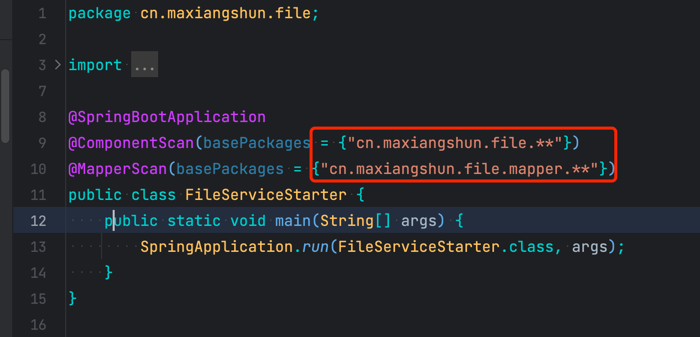
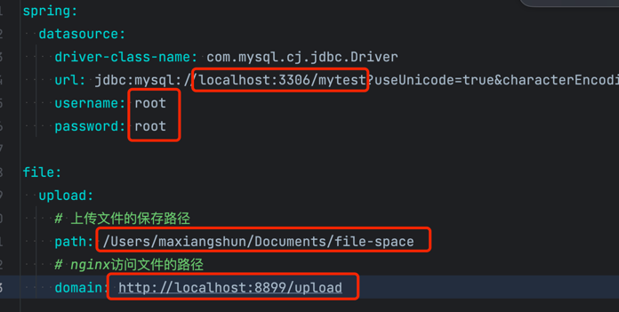
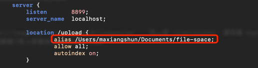
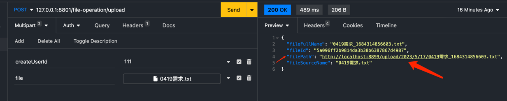

# 使用步骤

### 1. 执行SQL脚本
脚本位于根目录下, init.sql
复制sql前往自己的数据库执行表创建命令即可.

### 2. 修改FileServiceStarter启动类

修改为自己的包限定名

### 3. 修改application-dev.yml

其中file.upload.path 为文件上传路径, 请自行修改为服务器保存文件的路径, 最后不带 '/'
file.upload.domain 为文件下载路径, 请自行修改为nginx代理的下载文件的路径, 最后不带 '/'

### 4. Nginx关键配置:

/upload 是Nginx代理的上传文件路径的访问地址
alias 后面的路径为第3步中的file.upload.path

### 5. 启动项目
启动FileServiceStarter即可

### 6. 通过接口调用

直接访问该路径即可下载文件.
